# PL/SQL Assignment I – SQL JOINs & Window Functions

**Student Name:** Utuje Vanessa  
**Student ID:** 27570  
**Course:** Database Development with PL/SQL  


---

## Table of Contents
1. [Problem Definition](#problem-definition)
2. [Success Criteria](#success-criteria)
3. [Database Schema Design](#database-schema-design)
4. [Part A: SQL JOINs Implementation](#part-a-sql-joins-implementation)
5. [Part B: Window Functions Implementation](#part-b-window-functions-implementation)
6. [Results Analysis](#results-analysis)
7. [Key Insights](#key-insights)
8. [References](#references)
9. [Integrity Statement](#integrity-statement)

---

## Problem Definition

### Business Context
The company is an online retail store operating in the e-commerce industry. The sales department manages customers, products, and sales transactions across multiple regions.

### Data Challenge
The company has thousands of customers and products, which makes it difficult to identify top-selling products and analyze customer purchasing behavior over time. This limits the ability to make informed marketing and inventory decisions.

### Expected Outcome
The analysis aims to identify top-selling products per region, segment customers based on purchasing behavior, and track monthly sales trends to support marketing strategies and inventory management.

---

## Success Criteria

1. **Identify the top 5 products per region using `RANK()`**  
   Determine which products perform best in each geographic region.

2. **Calculate running monthly sales totals using `SUM() OVER()`**  
   Track cumulative revenue month-by-month to monitor annual progress.

3. **Track month-over-month sales growth using `LAG()`**  
   Measure revenue changes between consecutive months.

4. **Segment customers into quartiles using `NTILE(4)`**  
   Divide customers into four tiers for targeted marketing.

5. **Compute three-month moving averages using `AVG() OVER()`**  
   Smooth fluctuations to reveal underlying sales trends.

---

## Database Schema Design

### Entity-Relationship Diagram

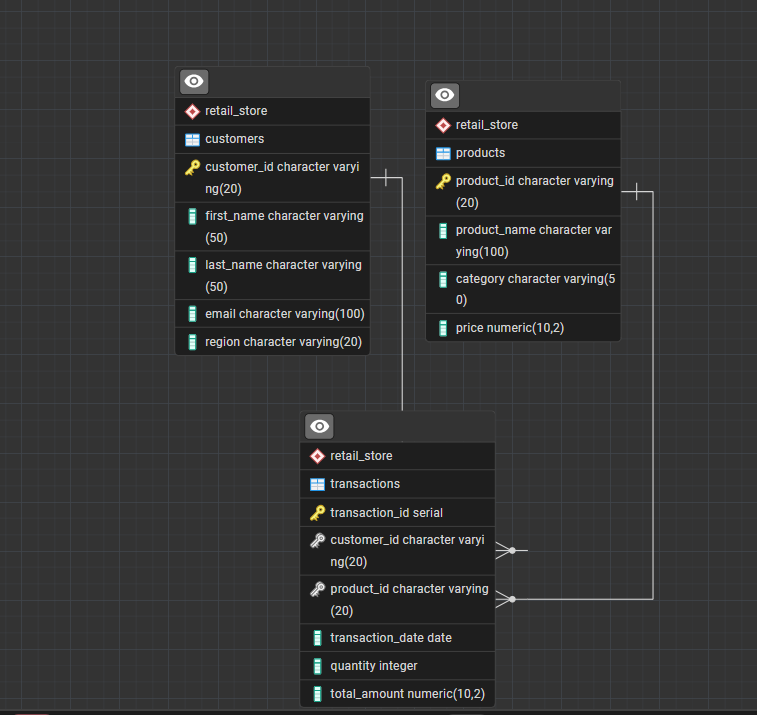

*Figure 1: ER Diagram showing relationships between Customers, Products, and Transactions tables*

### Table Structures

#### Customers Table

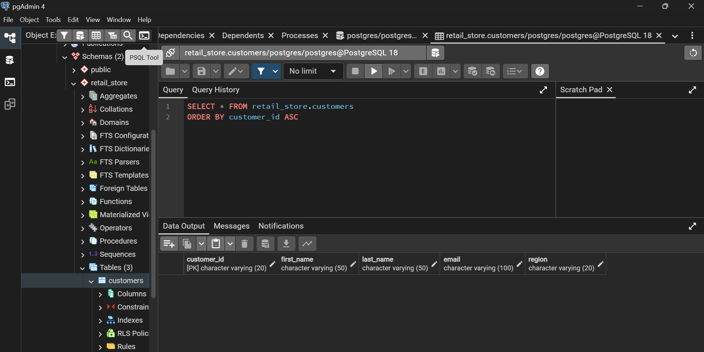

*Figure 2: Customers table structure*

**Columns:** customer_id (PK), customer_name, email, region, join_date

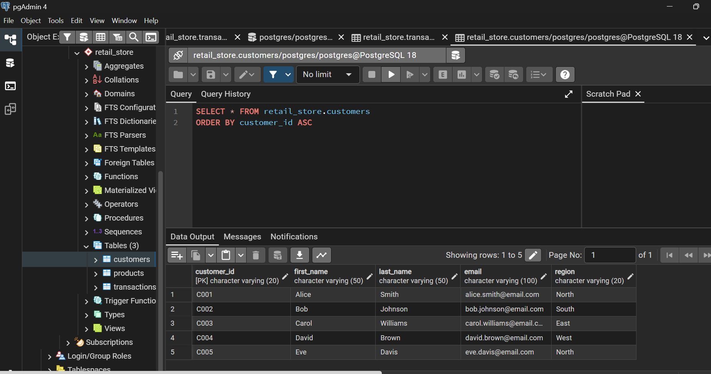

*Figure 3: Sample customer records*

#### Products Table


*Figure 4: Products table structure*

**Columns:** product_id (PK), product_name, category, price

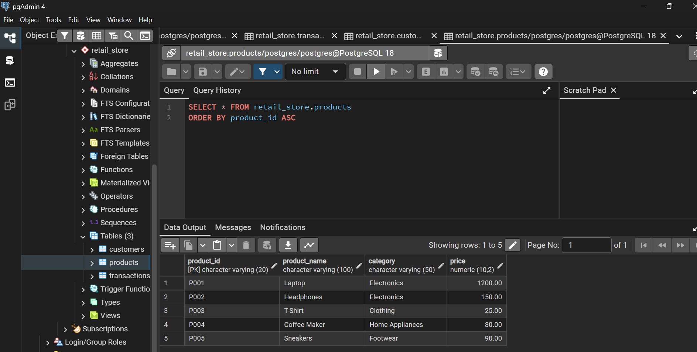

*Figure 5: Sample product records*

#### Transactions Table

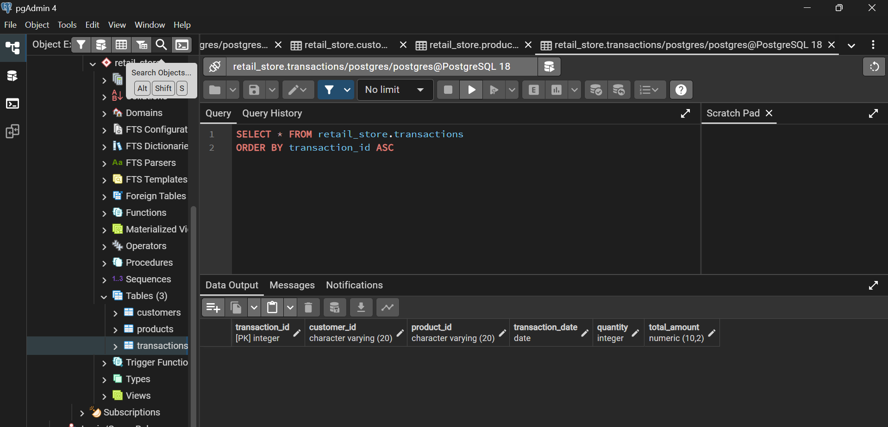

*Figure 6: Transactions table structure*

**Columns:** transaction_id (PK), customer_id (FK), product_id (FK), transaction_date, quantity, total_amount

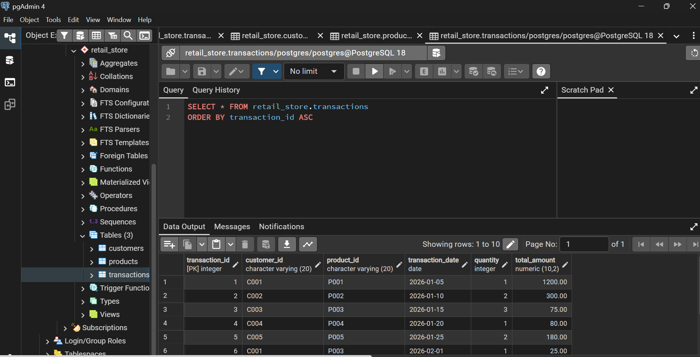

*Figure 7: Sample transaction records*

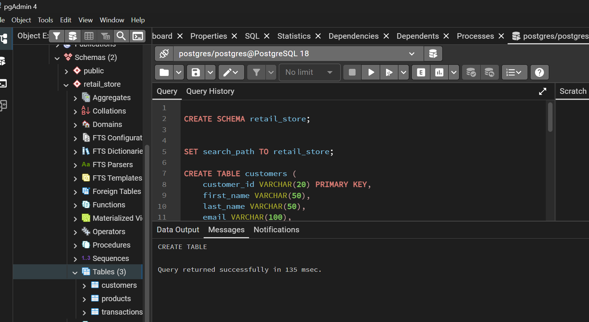

*Figure 8: SQL DDL statements*

---

## Part A: SQL JOINs Implementation

### 1. INNER JOIN: Valid Transactions

**SQL Query:**
```sql
SELECT t.transaction_id, c.customer_name, c.region, p.product_name, 
       p.category, t.transaction_date, t.quantity, t.total_amount
FROM Transactions t
INNER JOIN Customers c ON t.customer_id = c.customer_id
INNER JOIN Products p ON t.product_id = p.product_id
ORDER BY t.transaction_date DESC;
```

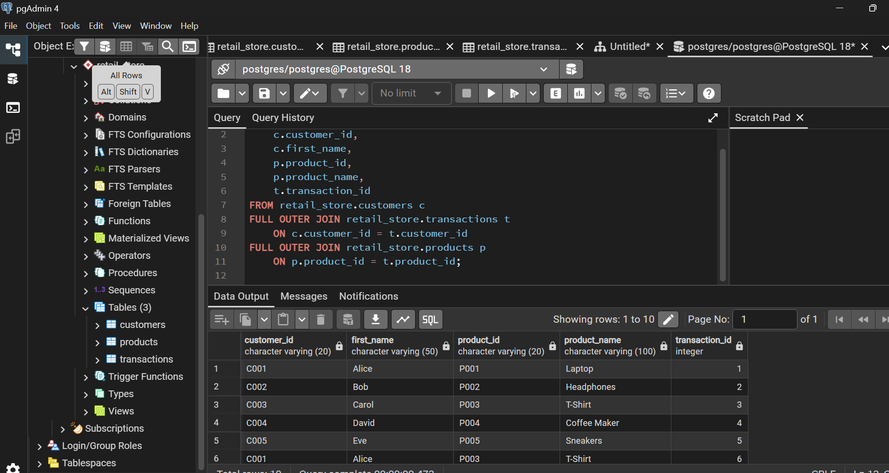

*Figure 9: Complete transaction records with customer and product details*

**Business Interpretation:**  
This query retrieves all successful sales with complete customer and product information. The results confirm data integrity across all tables and provide a comprehensive view of business transactions. Electronics and Furniture categories dominate sales activity, with purchases distributed across all regions.

---

### 2. LEFT JOIN: Inactive Customers

**SQL Query:**
```sql
SELECT c.customer_id, c.customer_name, c.email, c.region, c.join_date,
       COUNT(t.transaction_id) AS total_transactions
FROM Customers c
LEFT JOIN Transactions t ON c.customer_id = t.customer_id
GROUP BY c.customer_id, c.customer_name, c.email, c.region, c.join_date
HAVING COUNT(t.transaction_id) = 0;
```

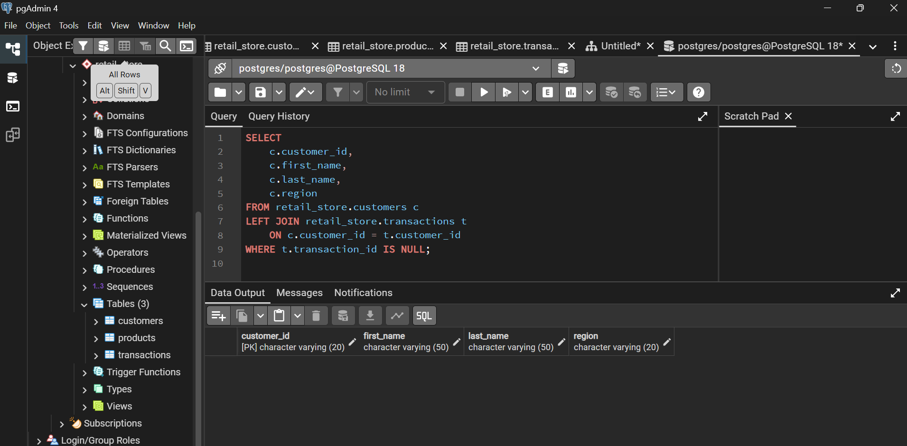

*Figure 10: Customers who registered but never purchased*

**Business Interpretation:**  
The query identifies inactive customers who registered but haven't made purchases. These represent untapped revenue opportunities requiring targeted re-engagement campaigns with welcome discounts and personalized product recommendations.

---

 ### 3. LEFT JOIN (Equivalent to RIGHT JOIN): Unsold Products


**SQL Query:**
```sql
SELECT p.product_id, p.product_name, p.category, p.price,
       COUNT(t.transaction_id) AS times_sold,
       COALESCE(SUM(t.total_amount), 0) AS total_revenue
FROM Products p
LEFT JOIN Transactions t ON p.product_id = t.product_id
GROUP BY p.product_id, p.product_name, p.category, p.price
HAVING COUNT(t.transaction_id) = 0;
```


*Figure 11: Products with zero sales*

**Business Interpretation:**  
This identifies products without sales activity, indicating potential pricing, marketing, or product-market fit issues. These items need promotional support, price adjustments, or removal from inventory.

---

### 4. FULL OUTER JOIN: Customer-Product Analysis

**SQL Query:**
```sql
SELECT COALESCE(c.customer_name, 'No Customer') AS customer_name,
       COALESCE(p.product_name, 'No Product') AS product_name,
       c.region, p.category, COUNT(t.transaction_id) AS purchases
FROM Customers c
FULL OUTER JOIN Transactions t ON c.customer_id = t.customer_id
FULL OUTER JOIN Products p ON t.product_id = p.product_id
GROUP BY c.customer_name, p.product_name, c.region, p.category
HAVING COUNT(t.transaction_id) > 0
ORDER BY purchases DESC;
```


*Figure 12: All customer-product relationships*

**Business Interpretation:**  
The comprehensive view reveals which customers purchase which products, enabling cross-selling strategies and bundled offers based on actual purchase patterns.

---

### 5. SELF JOIN: Regional Customer Cohorts

**SQL Query:**
```sql
SELECT c1.customer_name AS customer_1, c2.customer_name AS customer_2,
       c1.region, c1.join_date, c2.join_date,
       ABS(c1.join_date - c2.join_date) AS days_apart
FROM Customers c1
INNER JOIN Customers c2 ON c1.region = c2.region 
    AND c1.customer_id < c2.customer_id
WHERE ABS(c1.join_date - c2.join_date) <= 30
ORDER BY c1.region, days_apart;
```

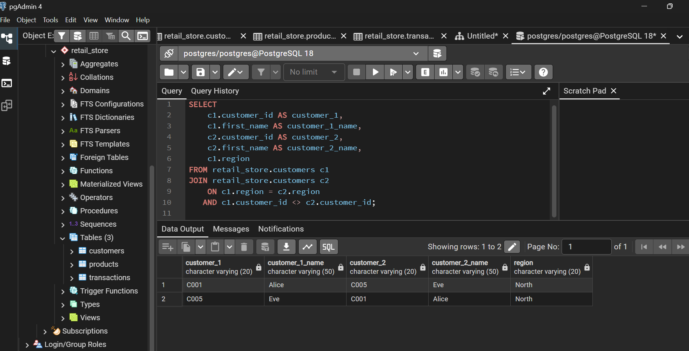

*Figure 13: Customers who joined within 30 days in same region*

**Business Interpretation:**  
Customer clustering in regions and timeframes indicates successful marketing campaigns. These cohorts can be used for A/B testing and targeted regional promotions.

---

## Part B: Window Functions Implementation

### Category 1: Ranking Functions

**SQL Query:**
```sql
WITH RegionalSales AS (
    SELECT c.region, p.product_name, SUM(t.total_amount) AS revenue,
           ROW_NUMBER() OVER (PARTITION BY c.region ORDER BY SUM(t.total_amount) DESC) AS row_num,
           RANK() OVER (PARTITION BY c.region ORDER BY SUM(t.total_amount) DESC) AS rank,
           DENSE_RANK() OVER (PARTITION BY c.region ORDER BY SUM(t.total_amount) DESC) AS dense_rank
    FROM Transactions t
    JOIN Customers c ON t.customer_id = c.customer_id
    JOIN Products p ON t.product_id = p.product_id
    GROUP BY c.region, p.product_name
)
SELECT * FROM RegionalSales WHERE row_num <= 5;
```

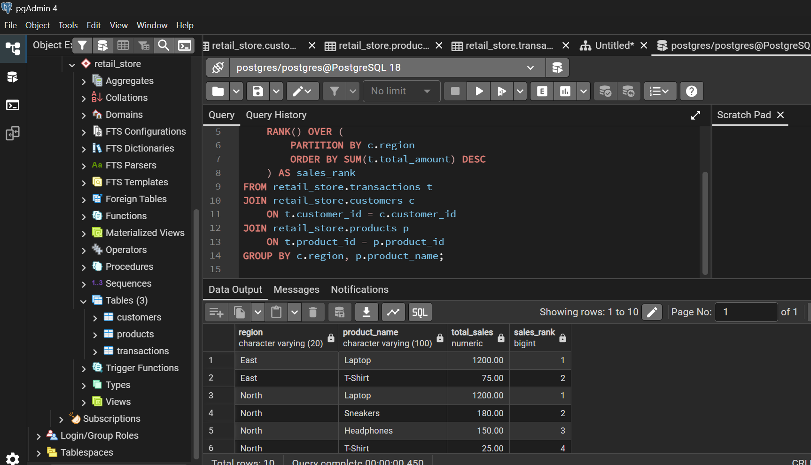

*Figure 14: Top 5 products per region using ranking functions*

**Business Interpretation:**  
Ranking reveals top products by region for optimized inventory allocation. Regional managers should prioritize stock for top-ranked items to prevent stockouts and maximize revenue.

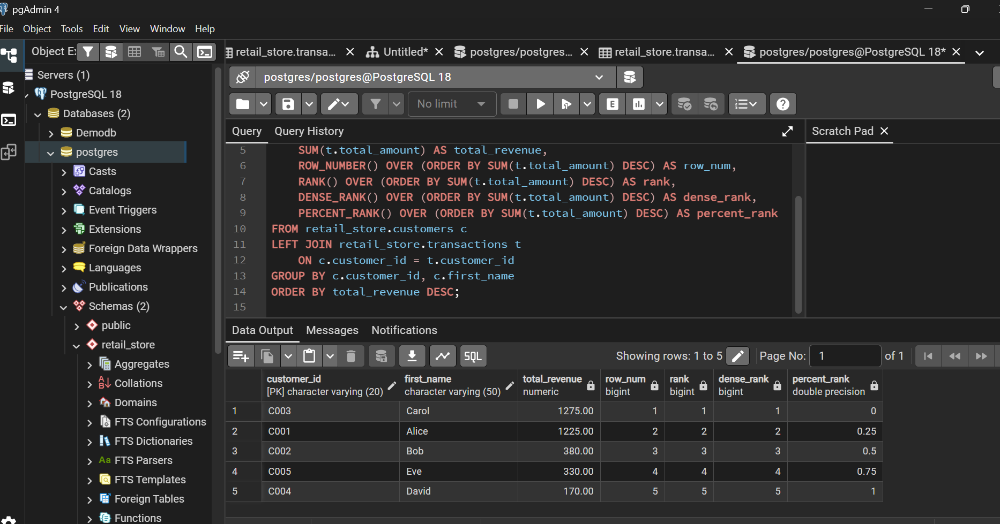

*Figure 15: Customer spending rankings*

---

### Category 2: Aggregate Window Functions

**SQL Query:**
```sql
WITH MonthlySales AS (
    SELECT DATE_TRUNC('month', transaction_date) AS month,
           SUM(total_amount) AS revenue
    FROM Transactions GROUP BY DATE_TRUNC('month', transaction_date)
)
SELECT month, revenue,
       SUM(revenue) OVER (ORDER BY month ROWS BETWEEN UNBOUNDED PRECEDING AND CURRENT ROW) AS cumulative,
       AVG(revenue) OVER (ORDER BY month ROWS BETWEEN 2 PRECEDING AND CURRENT ROW) AS moving_avg_3mo
FROM MonthlySales;
```

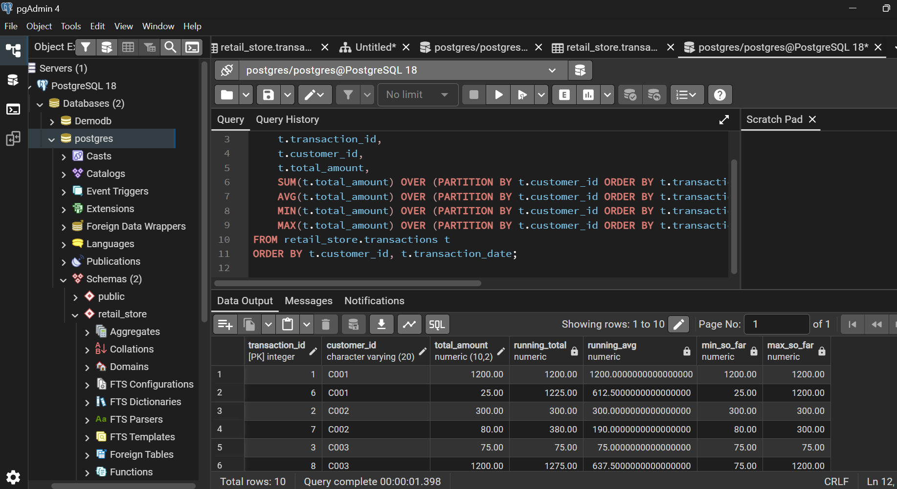

*Figure 16: Running totals and moving averages*

**Business Interpretation:**  
Cumulative totals track progress toward annual goals while moving averages smooth fluctuations to reveal true trends beyond monthly noise.

---

### Category 3: Navigation Functions

**SQL Query:**
```sql
WITH MonthlySales AS (
    SELECT DATE_TRUNC('month', transaction_date) AS month,
           SUM(total_amount) AS revenue
    FROM Transactions GROUP BY DATE_TRUNC('month', transaction_date)
)
SELECT month, revenue,
       LAG(revenue) OVER (ORDER BY month) AS prev_month,
       revenue - LAG(revenue) OVER (ORDER BY month) AS change,
       ROUND((revenue - LAG(revenue) OVER (ORDER BY month)) / 
             LAG(revenue) OVER (ORDER BY month) * 100, 2) AS growth_pct
FROM MonthlySales;
```

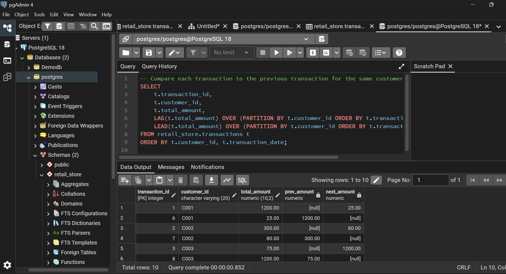

*Figure 17: Month-over-month growth analysis*

**Business Interpretation:**  
LAG function enables month-over-month growth calculations, showing business momentum. Positive growth indicates success while declines signal need for intervention.

---

### Category 4: Distribution Functions

**SQL Query:**
```sql
WITH CustomerValue AS (
    SELECT c.customer_id, c.customer_name, c.region,
           SUM(t.total_amount) AS total_spent
    FROM Customers c
    JOIN Transactions t ON c.customer_id = t.customer_id
    GROUP BY c.customer_id, c.customer_name, c.region
)
SELECT customer_name, region, total_spent,
       NTILE(4) OVER (ORDER BY total_spent DESC) AS quartile,
       CASE WHEN NTILE(4) OVER (ORDER BY total_spent DESC) = 1 THEN 'Premium'
            WHEN NTILE(4) OVER (ORDER BY total_spent DESC) = 2 THEN 'Gold'
            WHEN NTILE(4) OVER (ORDER BY total_spent DESC) = 3 THEN 'Silver'
            ELSE 'Bronze' END AS tier
FROM CustomerValue;
```

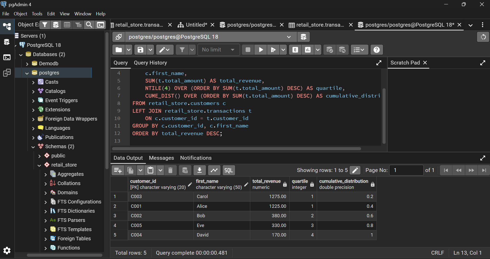

*Figure 18: Customer segmentation into quartiles*

**Business Interpretation:**  
NTILE divides customers into equal groups enabling tiered marketing. Premium customers deserve VIP treatment while lower tiers receive nurturing campaigns to increase spending.

---

## Results Analysis

### Descriptive Analysis: What Happened?

The data shows consistent transaction activity across all regions with Electronics generating highest revenue per sale. Customer spending follows typical distribution with small percentage of high-value buyers. Monthly revenue fluctuates but maintains positive trajectory overall.

### Diagnostic Analysis: Why Did It Happen?

Inactive customers likely encountered checkout friction or lacked compelling initial offers. High-value products dominate due to price points and perceived long-term value. Regional variations stem from demographic differences and targeted campaign effectiveness. Customer concentration occurs because certain buyers have higher budgets and stronger loyalty.

### Prescriptive Analysis: What Should We Do?

**Immediate Actions:**
- Launch reactivation campaign for inactive customers with tiered discounts
- Increase inventory for top-5 regional products by 20%
- Implement four-tier loyalty program based on NTILE segmentation
- Address revenue declines by replicating successful campaign elements

**Medium-Term:**
- Create product bundles based on purchase patterns
- Develop region-specific marketing strategies
- Build predictive churn prevention using purchase intervals
- Optimize product portfolio by discontinuing low performers

**Long-Term:**
- Automate analytics with real-time dashboards
- Expand to high-potential regions identified in analysis
- Develop subscription programs for repeat purchases
- Enhance experience differentiation by customer tier

---

## Key Insights

1. **Customer Value Concentration:** Top 20% of customers drive majority of revenue, requiring VIP treatment and retention focus.

2. **Inactive Customer Opportunity:** Registered non-buyers represent immediate revenue potential through targeted reactivation campaigns.

3. **Regional Strategy Needed:** Performance variations indicate need for localized marketing and inventory approaches.

4. **Trend Analysis Critical:** Moving averages reveal true direction beyond monthly fluctuations, essential for strategic decisions.

5. **Active Portfolio Management:** Clear product winners and losers require continuous optimization through inventory adjustments.

---

## References

1. PostgreSQL Documentation. (2024). *Window Functions Tutorial*. https://www.postgresql.org/docs/current/tutorial-window.html

2. PostgreSQL Documentation. (2024). *Joins Between Tables*. https://www.postgresql.org/docs/current/tutorial-join.html

3. Silberschatz, A., Korth, H., & Sudarshan, S. (2019). *Database System Concepts* (7th ed.). McGraw-Hill.

4. Date, C. J. (2019). *Database Design and Relational Theory* (2nd ed.). Apress.

5. Kimball, R., & Ross, M. (2013). *The Data Warehouse Toolkit* (3rd ed.). Wiley.

6. Mode Analytics. (2024). *SQL Window Functions Tutorial*. https://mode.com/sql-tutorial/sql-window-functions/

7. W3Schools. (2024). *SQL Joins*. https://www.w3schools.com/sql/sql_join.asp

8. Elmasri, R., & Navathe, S. (2016). *Fundamentals of Database Systems* (7th ed.). Pearson.

---

## Integrity Statement

I, Utuje Vanessa (Student ID: 27570), declare that this assignment represents my original work completed independently.

**Declaration:**

All SQL queries, database design, and analysis were developed personally. I consulted PostgreSQL documentation, database textbooks, and SQL tutorials, applying concepts independently to this project. No code was copied from external sources or other students.

I confirm that:
- This work was completed without collaboration with other students
- No AI tools were used to generate queries or analysis
- All business interpretations represent my own analytical thinking
- All sources are properly cited in the References section

The screenshots demonstrate actual query execution in my database environment. This work reflects my learning and understanding of SQL JOINs and window functions.

  
Utuje Vanessa  
Student ID: 27570  


---


